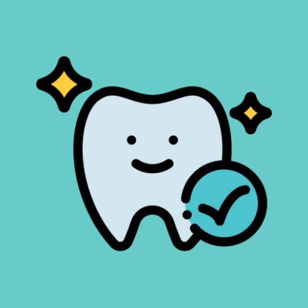
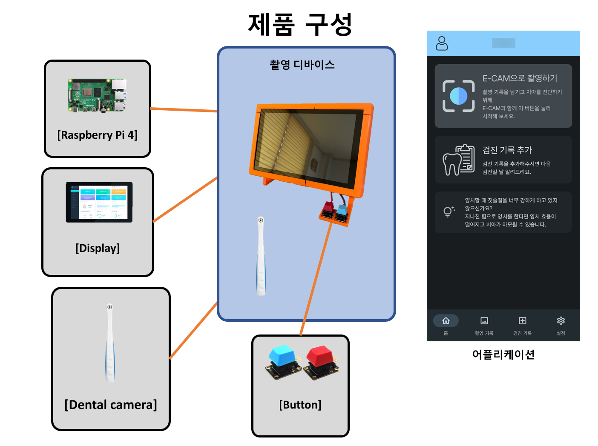
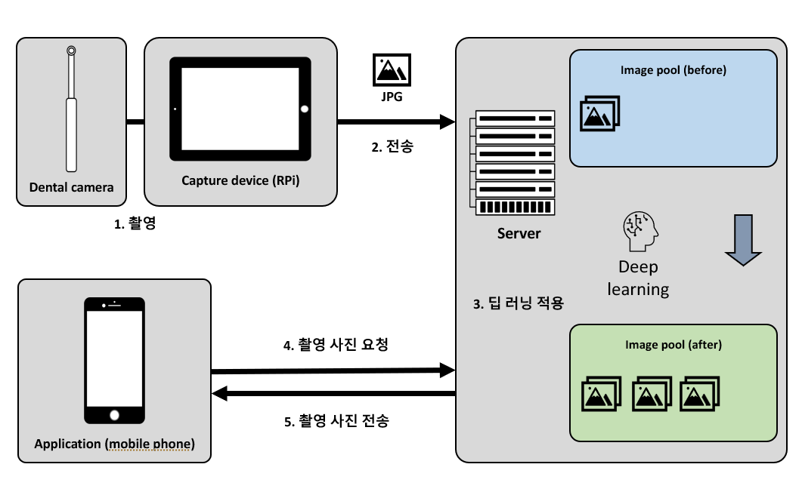
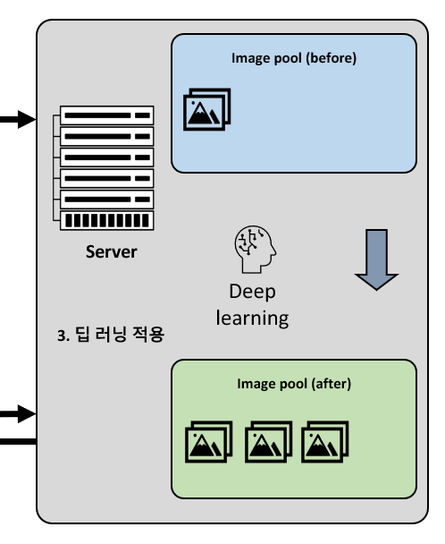
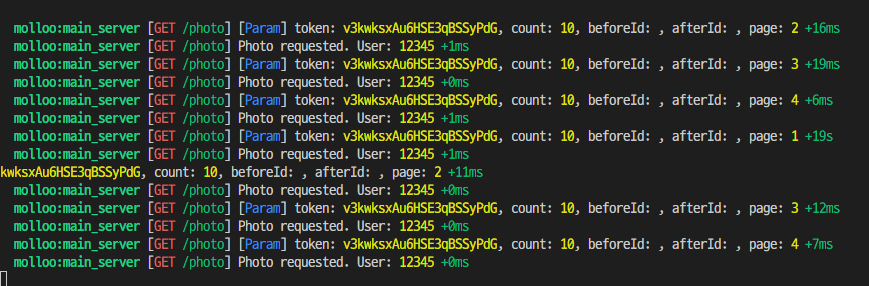
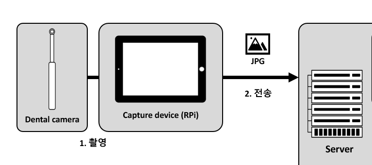
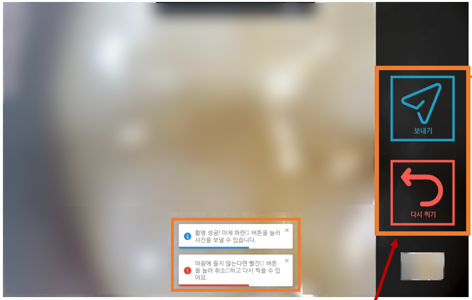
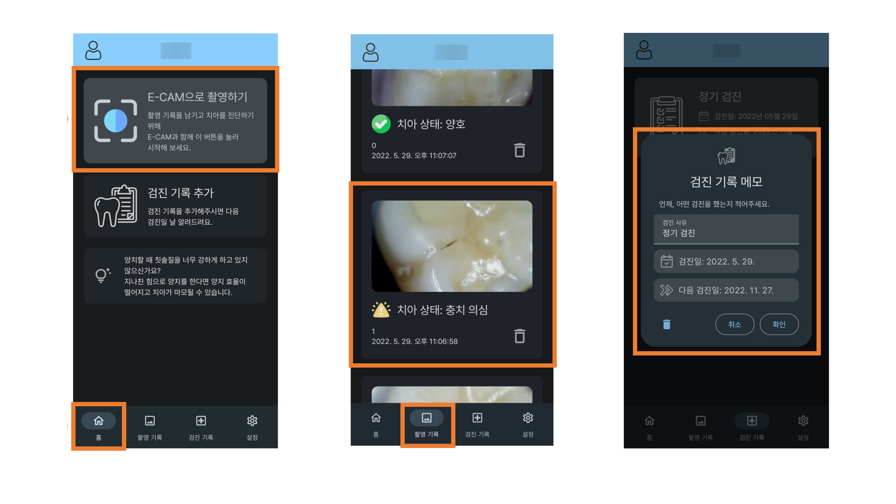
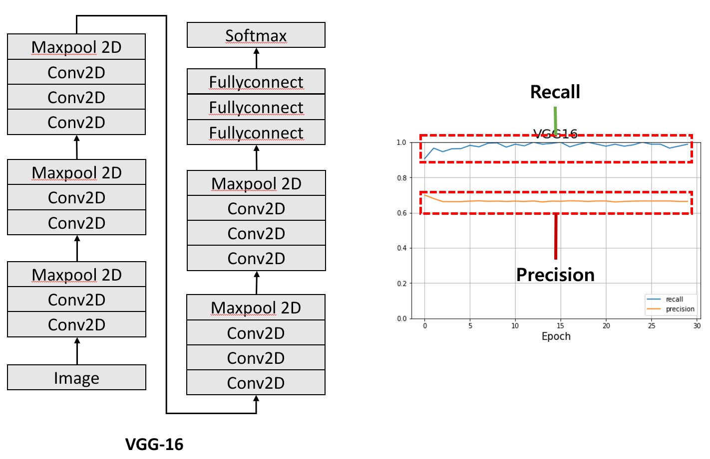

# E-Cam

E-Cam은 사용자가 직접 충치 진단을 할 수 있는 앱입니다.

카메라 장치를 사용해 사진을 찍고 이를 통해 머신러닝 모델을 사용해 진단을 합니다.

## 구성 요소

## 사용 시나리오

# Main-Server

진단 결과 및 사진을 저장하고 앱을 통해 촬영 장치를 키거나, 진단 결과를 볼 수 있게 하는 서버입니다.

# Model-Server

모델을 적용하여 `Main-Server`에게 사진의 측정 결과를 알려주는 **내부** 서버입니다.

# Cam-Device

사용자의 요청이 있으면 화면을 띄워주고 `Main-Server`와 통신하면서 사용자가 치아 사진을 찍고 `Main-Server`에게 보내주는 촬영 장치의 **백앤드** 서버입니다.

 * [webrtc-streamer](https://github.com/mpromonet/webrtc-streamer)를 다운받아 실행합니다.
 * 물리적인 촬영 버튼(GPIO) 인식도 합니다.
 * `Cam-Device-Next`는 Puppeteer를 띄워 보여줍니다.

# Cam-Device-Next

사용자에게 치아 촬영을 실시간으로 보여주고 상호작용하기 위한 **프론트앤드** UI 서버 입니다.

 * [react-camera-pro](https://github.com/purple-technology/react-camera-pro) 기반으로 webrtc-streamer와 호환되게 수정했습니다.

# Android-App

사용자가 촬영을 시작하고 촬영 결과를 확인하는 안드로이드 앱입니다.

 * 촬영 요청(`Cam-Device`)
 * 촬영 결과 보기
 * 검진 주기 설정

을 할 수 있습니다.

# ML

머신러닝을 적용한 모델 생성 테스트 용입니다.

# DL

`Model-Server`에서 적용할 딥러닝 모델을 뽑는 프로젝트 입니다.

CNN 알고리즘 중에서 VGG-16을 사용하였습니다.